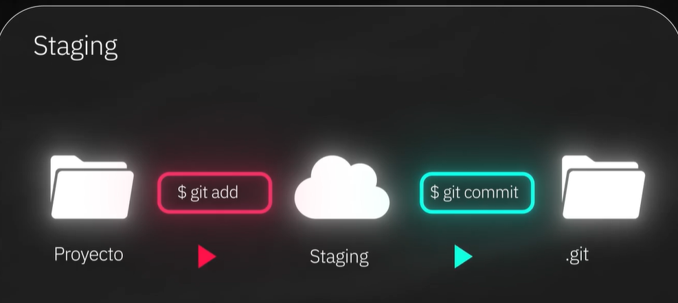
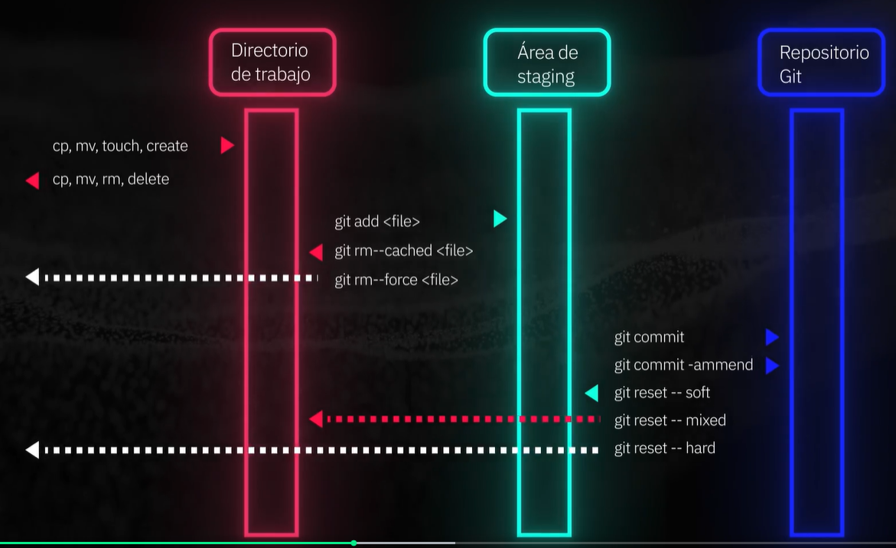
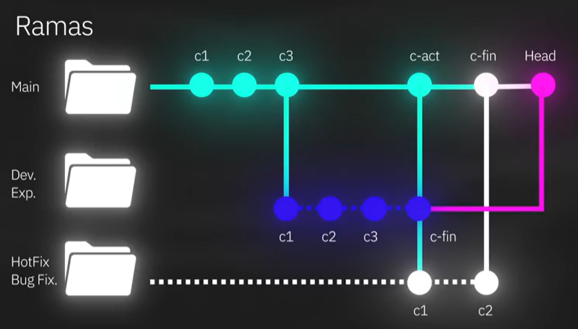
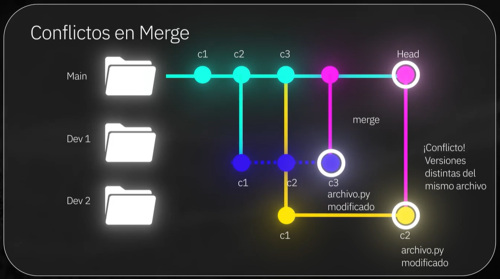
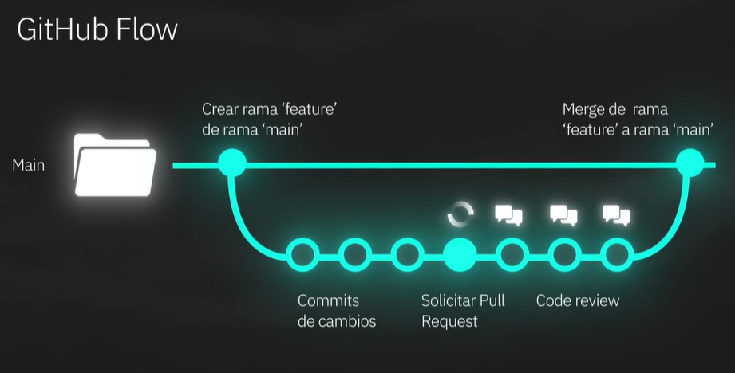
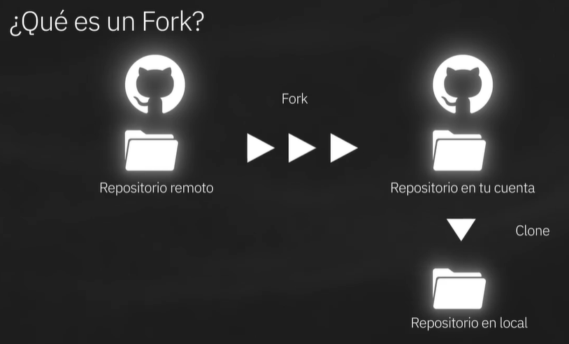
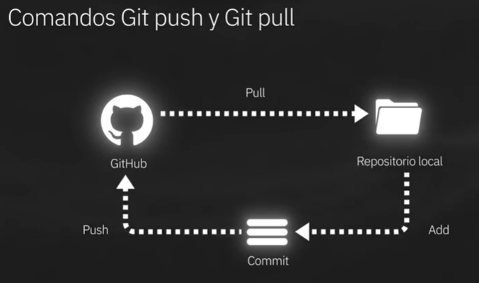
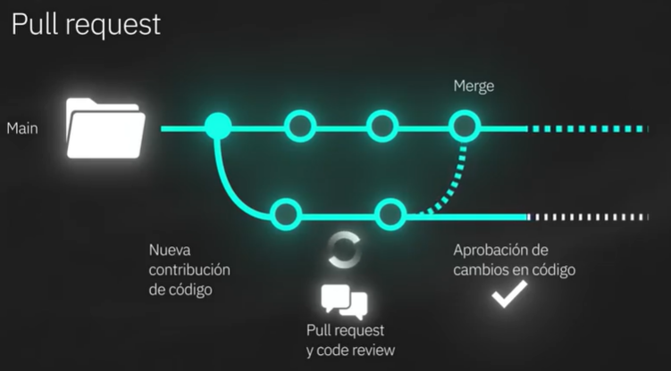
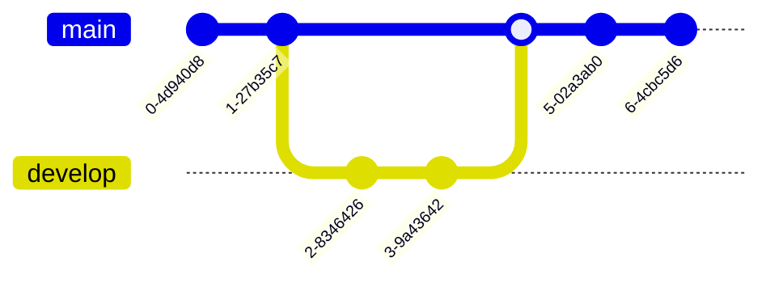

# Git y Github

## ¿Que son Git y Github?

- **Git =>**
  - Software de control de versiones, solo guarda los cambios especificos.
  - Creador Linus Torvalds, es Open Source.
  - Anteriormente era un problema el trabajar en proyectos grandes, es un estandar actualmente muy usado.
  - Aumenta productividad y se utiliza a traves de la terminal.

## Configuracion Inicial de `git init` y `config`

``` CLI
// Confirmar version
git --version
// Iniciar Proyecto
git init
```

Esto inicia el proyecto y establece la rama **master** por defecto, es necesario actualizar la rama por defecto a **main** ya que este es el estandar actual.

Se lo realiza de la siguiente manera:

``` CLI
git config --global init.defaultBranch main
```

El comando de arriba configura por defecto que al usar `git init` se creara la rama **main**

Para ver la ayuda de git se utiliza el siguiente comando `git --help`

El flag `--global` aplica la configuracion de manera global en la computadora, dos parametros importantes son configurar el `usuario/nombre` y el `email`, se utiliza los siguientes comando:

``` CLI
git config --global user.name "<Nombre>"
git config --global user.email "<email>"
```

Para poder ver las configuraciones:

``` CLI
git config --list
// Ejemplo de Output
user.name=<name>
user.email=<email@gmail.com>
init.defaultbranch=main
```

## Comandos Basicos de Git: add, commit y log

El comando `git init` crea una carpte oculta con el nombre `.git` donde se guarda toda la informacion de los cambios realizados.

``` CLI
┌─(~/Workspace/git-github)───────────────────────────────────────────────────────────────────────────────────────────────────────────────────────────────────────────────────(leugim@terminator:pts/0)─┐
└─(17:32:07 on main ✹)──> ls -lha                                                                                                                                                        ──(Sat,Nov16)─┘
total 16K
drwxrwxr-x 3 leugim leugim 4.0K Nov 15 01:23 .
drwxrwxr-x 5 leugim leugim 4.0K Nov 15 01:23 ..
drwxrwxr-x 8 leugim leugim 4.0K Nov 16 17:30 .git
-rw-rw-r-- 1 leugim leugim 1.5K Nov 16 17:32 README.md
```

Cuando se realizan cambios se puede conocer el estado de los archivos con el comando `git status`

``` CLI
┌─(~/Workspace/git-github)───────────────────────────────────────────────────────────────────────────────────────────────────────────────────────────────────────────────────(leugim@terminator:pts/0)─┐
└─(17:32:12 on main ✹)──> git status                                                                                                                                                     ──(Sat,Nov16)─┘
On branch main
Your branch is ahead of 'origin/main' by 1 commit.
  (use "git push" to publish your local commits)

Changes not staged for commit:
  (use "git add <file>..." to update what will be committed)
  (use "git restore <file>..." to discard changes in working directory)
        modified:   README.md

no changes added to commit (use "git add" and/or "git commit -a")
```

Para agregar un archivo se utiliza el comando `git add <Archivo>` esto hace que el archivo entre a stage pero no agregado completamente "no comiteado".

``` CLI
┌─(~/Workspace/git-github)───────────────────────────────────────────────────────────────────────────────────────────────────────────────────────────────────────────────────(leugim@terminator:pts/0)─┐
└─(17:33:07 on main ✹)──> git add README.md                                                                                                                                              ──(Sat,Nov16)─┘
┌─(~/Workspace/git-github)───────────────────────────────────────────────────────────────────────────────────────────────────────────────────────────────────────────────────(leugim@terminator:pts/0)─┐
└─(17:45:32 on main ✹)──> git status                                                                                                                                                     ──(Sat,Nov16)─┘
On branch main
Your branch is ahead of 'origin/main' by 1 commit.
  (use "git push" to publish your local commits)

Changes to be committed:
  (use "git restore --staged <file>..." to unstage)
        modified:   README.md
```

Una manera grafica de verlo es la siguiente:


Flujo de trabajo normal:


Para sacarlo de staging se puede utilizar el comando `git rm --cached <Archivo>`
Para guardarlos en el repositorio despues que se encuentre en staging el comando es `git commit -m '<mensaje>'`

### Logs

Para ver la bitacora de los comandos `git log`

``` CLI
commit 22cba934950c50f24b49bff34dd764d47711747a (HEAD -> main)
Author: Junior <miguel.ajr89@gmail.com>
Date:   Sat Nov 16 18:00:26 2024 +0000

    Comandos agregados

commit d11b6912e05393e5aaa179be1946b689cce86a90
Author: Junior <miguel.ajr89@gmail.com>
Date:   Sat Nov 16 17:56:41 2024 +0000

    Agregados ejemplos de comandos e imagenes

commit b816250b44e6a849ba3ac15a9e5ac20226ef795c
Author: Junior <miguel.ajr89@gmail.com>
Date:   Sat Nov 16 17:30:55 2024 +0000

    Areglando subtitulos de clases

commit b8672592e208b0b3a9d5a46eafd57c9beaff351e (origin/main, origin/HEAD)
Author: Junior <miguel.ajr89@gmail.com>
Date:   Fri Nov 15 01:42:56 2024 +0000

    Agregando primeras notas

commit d081e382506f4bfdb5b4ec563f72535bd1f4e2a5
Author: Junior <miguel.ajr89@gmail.com>
Date:   Thu Nov 14 21:23:16 2024 -0400

    Initial commit
```

## Ramas y Fusión de Cambios: branch, merge, switch y checkout

### Ramas | Branches

El concepto de ramas es creo para poder trabajar de manera aislada a las demas personas:


Existen distintas manera de crear y cambiar ramas las cuales son:

- Para conocer en que rama uno se encuentra utiliza el comando `git branch`
- Para crear una nueva rama se utiliza el comando `git branch <Nombre rama>`
- Para cambiar a otra rama se utiliza el comando `git checkout <nombre rama a cambiar>`
- Para cambiar a otra rama se utiliza el comando `git switch <nombre rama a cambiar>`
- Para crear y cambiar a esa nueva rama se utiliza el comando `git checkout -b <nombre nueva rama>`
- Para crear y cambiar a esa nueva rama se utiliza el comando `git switch -b <nombre nueva rama>`

### Merge | Fusion

Para fusionar los cambios de una rama a otra es necesario utilizar el comando `git merge`. Supongamos que nos encontramos en la rama `main` y queremos fusionar los cambios de una rama individual con el nombre `rama-1`, entonces es necesario situarce en la rama `main` y ejecutar el comando `git merge rama-1` es decir indicar a la rama main que cambios de que rama se va a traer para fusionarlos.

### Eliminar o borrar una rama

Para eliminar una rama de manera local que no se utilizara mas se utiliza el comando `git branch -D <nombre rama a eliminar>`

## Volviendo en el Tiempo en Git: reset y revert

La diferencia entre ambos:

- `git reset` El comando reset te devuelve a un commit anterior, eliminando los cambios en el historial como si nunca hubieran ocurrido.
- `git revert` Crea un nuevo commit que "revierte" los cambios realizados por un commit especifico.

Manera de ejecutar los comandos:

- `git revert <id commit a revertir>` Se mostrara un mensaje del nuevo commit que se creara con el commit que se revirtio
- `git reset --hard <id commit a volver>` Se eliminaran los commits/historial hasta antes de este identificador.
- Se tienen 3 parametros importantes:
  - `soft` que permite eliminar los archivos
  - `mixed` que permite regresar los commits
  - `hard` permite deshacer todos los cambios **(esta es la ultima opcion a utilizar)**

Los problemas que resuelven:

- Correccion de errores
- Limpieza del historial
- Manejo de conflictos entre algunas ramas.

## Gestion de versiones: tag y checkout

- `git tag` Un tag es como una etiqueta que puedes aplicar a un commit para identificarlo facilmente en el futuro.
- `git checkout` Cambiar de una rama o un commit especifico a otro.
Uso de `git tag` para aplicar al head que se encuentra por el momento `git tag -a v1.0 -m "Mi primera version"`

### git tag

Antes de usar `git tag`

``` CLI
commit f7c4c6478c639141a3de20288a5f48ae164558b9 (HEAD -> main)
Author: Junior <miguel.ajr89@gmail.com>
Date:   Sun Jan 12 21:39:02 2025 -0400

    Volviendo en el tiempo, git revert y git reset | Arreglo de un typo

commit 9a916177083fc26578a2a03c81805b421e271f76 (origin/main, origin/HEAD)
Author: Junior <miguel.ajr89@gmail.com>
Date:   Wed Jan 8 03:06:56 2025 +0000

    Ultimo commit desde server

commit f016ff247b9750c11c2fd03a0db684312ed6fe70
Author: Junior <miguel.ajr89@gmail.com>
Date:   Sat Nov 16 18:20:28 2024 +0000

    Agregando notas de trabajo con ramas
```

Despues de Utilizar `git tag`

``` CLI
commit f7c4c6478c639141a3de20288a5f48ae164558b9 (HEAD -> main, tag: v1.0)
Author: Junior <miguel.ajr89@gmail.com>
Date:   Sun Jan 12 21:39:02 2025 -0400

    Volviendo en el tiempo, git revert y git reset | Arreglo de un typo

commit 9a916177083fc26578a2a03c81805b421e271f76 (origin/main, origin/HEAD)
Author: Junior <miguel.ajr89@gmail.com>
Date:   Wed Jan 8 03:06:56 2025 +0000

    Ultimo commit desde server

commit f016ff247b9750c11c2fd03a0db684312ed6fe70
Author: Junior <miguel.ajr89@gmail.com>
Date:   Sat Nov 16 18:20:28 2024 +0000

    Agregando notas de trabajo con ramas
```

Solamente utilizando `git tag` me mostrara la lista de solo de las etiquetas en el repositorio

``` CLI
┌─(~/Workspace/git-github)─────────────────────────────────────────────────────────────────────────────────────────────────(junior@JRODRIGUEV-NH01:pts/4)─┐
└─(21:46:21 on main ✹)──> git tag
v1.0
```

Para ver los commits de una etiqueta especifica se utiliza el comando `git show <version>`

``` CLI
┌─(~/Workspace/git-github)─────────────────────────────────────────────────────────────────────────────────────────────────(junior@JRODRIGUEV-NH01:pts/4)─┐
└─(21:46:42 on main ✹)──> git show v1.0                                                                                                     ──(Sun,Jan12)─┘
tag v1.0
Tagger: Junior <miguel.ajr89@gmail.com>
Date:   Sun Jan 12 21:44:16 2025 -0400

Mi primera version

commit f7c4c6478c639141a3de20288a5f48ae164558b9 (HEAD -> main, tag: v1.0)
Author: Junior <miguel.ajr89@gmail.com>
Date:   Sun Jan 12 21:39:02 2025 -0400

    Volviendo en el tiempo, git revert y git reset | Arreglo de un typo

diff --git a/README.md b/README.md
index b3c435a..3b373a5 100644
--- a/README.md
+++ b/README.md
@@ -1,10 +1,9 @@
 # Git y Github
-
 ## ¿Que son Git y Github?
 - **Git =>**
     - Software de control de versiones, solo guarda los cambios especificos.
     - Creador Linus Torvalds, es Open Source.
-    - Anteriormente era un problema el trabajar en proyecdtos grandes, es un estandar actualmente muy usado.
+    - Anteriormente era un problema el trabajar en proyectos grandes, es un estandar actualmente muy usado.
     - Aumenta productividad y se utiliza a traves de la terminal.

 ## Configuracion Inicial de `git init` y `config`
@@ -140,3 +139,19 @@ Para fusionar los cambios de una rama a otra es necesario utilizar el comando `g
 ### Eliminar o borrar una rama
 Para eliminar una rama de manera local que no se utilizara mas se utiliza el comando `git branch -D <nombre rama a eliminar>`
 ## Volviendo en el Tiempo en Git: reset y revert
+La diferencia entre ambos:
+- `git reset` El comando reset te devuelve a un commit anterior, eliminando los cambios en el historial como si nunca hubieran ocurrido.
+- `git revert` Crea un nuevo commit que "revierte" los cambios realizados por un commit especifico.
+
+Manera de ejecutar los comandos:
+- `git revert <id commit a revertir>` Se mostrara un mensaje del nuevo commit que se creara con el commit que se revirtio
+- `git reset --hard <id commit a volver>` Se eliminaran los commits/historial hasta antes de este identificador.
+- Se tienen 3 parametros importantes:
+  - `soft` que permite eliminar los archivos
+  - `mixed` que permite regresar los commits
+  - `hard` permite deshacer todos los cambios **(esta es la ultima opcion a utilizar)**
+
+Los problemas que resuelven:
+- Correccion de errores
+- Limpieza del historial
+- Manejo de conflictos entre algunas ramas.
```

Para eliminar un tag se utiliza el comando `git tag -d <tag a eliminar>` esto no altera el historial de commits

``` CLI
┌─(~/Workspace/git-github)─────────────────────────────────────────────────────────────────────────────────────────────────(junior@JRODRIGUEV-NH01:pts/4)─┐
└─(21:52:37 on main ✹)──> git tag -d v1.0                                                                                                   ──(Sun,Jan12)─┘
Deleted tag 'v1.0' (was 47ba34d)
```

### git checkout

Si se quiere hacer una revision de un punto en particular sin eliminar el avance realizado se puede realizar con el comando `git checkout <identificador commit>`
Para volver al punto del principio se utiliza el comando `git checkout main`
Ejemplo:

- Antes de utilizar `git checkout` con un id especifico

``` CLI
commit 24c379e91797db4c5e5e2288d054d14183c77623 (HEAD -> main, origin/main, origin/HEAD)
Author: Junior <miguel.ajr89@gmail.com>
Date:   Sun Jan 12 21:58:57 2025 -0400

    Leccion de git tag y git checkout

commit f7c4c6478c639141a3de20288a5f48ae164558b9
Author: Junior <miguel.ajr89@gmail.com>
Date:   Sun Jan 12 21:39:02 2025 -0400

    Volviendo en el tiempo, git revert y git reset | Arreglo de un typo

commit 9a916177083fc26578a2a03c81805b421e271f76
Author: Junior <miguel.ajr89@gmail.com>
Date:   Wed Jan 8 03:06:56 2025 +0000

    Ultimo commit desde server

commit f016ff247b9750c11c2fd03a0db684312ed6fe70
Author: Junior <miguel.ajr89@gmail.com>
Date:   Sat Nov 16 18:20:28 2024 +0000

    Agregando notas de trabajo con ramas

commit d3234782754c19e16ed6f6d00d1273a44195e157
Author: Junior <miguel.ajr89@gmail.com>
Date:   Sat Nov 16 18:05:21 2024 +0000

    Agregando como ver logs

commit 22cba934950c50f24b49bff34dd764d47711747a
Author: Junior <miguel.ajr89@gmail.com>
Date:   Sat Nov 16 18:00:26 2024 +0000

    Comandos agregados
```

- Despues de utilizar `git checkout` con un id especifico

``` CLI
┌─(~/Workspace/git-github)─────────────────────────────────────────────────────────────────────────────────────────────────(junior@JRODRIGUEV-NH01:pts/4)─┐
└─(22:00:46 on main)──> git checkout 22cba934950c50f24b49bff34dd764d47711747a                                                               ──(Sun,Jan12)─┘
Note: switching to '22cba934950c50f24b49bff34dd764d47711747a'.

You are in 'detached HEAD' state. You can look around, make experimental
changes and commit them, and you can discard any commits you make in this
state without impacting any branches by switching back to a branch.

If you want to create a new branch to retain commits you create, you may
do so (now or later) by using -c with the switch command. Example:

  git switch -c <new-branch-name>

Or undo this operation with:

  git switch -

Turn off this advice by setting config variable advice.detachedHead to false

HEAD is now at 22cba93 Comandos agregados
```

- Revisando el log con `git log`

``` CLI
commit 22cba934950c50f24b49bff34dd764d47711747a (HEAD)
Author: Junior <miguel.ajr89@gmail.com>
Date:   Sat Nov 16 18:00:26 2024 +0000

    Comandos agregados

commit d11b6912e05393e5aaa179be1946b689cce86a90
Author: Junior <miguel.ajr89@gmail.com>
Date:   Sat Nov 16 17:56:41 2024 +0000

    Agregados ejemplos de comandos e imagenes

commit b816250b44e6a849ba3ac15a9e5ac20226ef795c
Author: Junior <miguel.ajr89@gmail.com>
Date:   Sat Nov 16 17:30:55 2024 +0000

    Areglando subtitulos de clases

commit b8672592e208b0b3a9d5a46eafd57c9beaff351e
Author: Junior <miguel.ajr89@gmail.com>
Date:   Fri Nov 15 01:42:56 2024 +0000

    Agregando primeras notas

commit d081e382506f4bfdb5b4ec563f72535bd1f4e2a5
Author: Junior <miguel.ajr89@gmail.com>
Date:   Thu Nov 14 21:23:16 2024 -0400

    Initial commit
```

- Volviendo al estado inicial con `git checkout main`

``` CLI
┌─(~/Workspace/git-github)─────────────────────────────────────────────────────────────────────────────────────────────────(junior@JRODRIGUEV-NH01:pts/4)─┐
└─(22:01:55 on 22cba93)──> git checkout main                                                                                                ──(Sun,Jan12)─┘
Previous HEAD position was 22cba93 Comandos agregados
Switched to branch 'main'
Your branch is up to date with 'origin/main'.
```

- Revisando el log con `git log` **Como era en un principio**

``` CLI
commit 24c379e91797db4c5e5e2288d054d14183c77623 (HEAD -> main, origin/main, origin/HEAD)
Author: Junior <miguel.ajr89@gmail.com>
Date:   Sun Jan 12 21:58:57 2025 -0400

    Leccion de git tag y git checkout

commit f7c4c6478c639141a3de20288a5f48ae164558b9
Author: Junior <miguel.ajr89@gmail.com>
Date:   Sun Jan 12 21:39:02 2025 -0400

    Volviendo en el tiempo, git revert y git reset | Arreglo de un typo

commit 9a916177083fc26578a2a03c81805b421e271f76
Author: Junior <miguel.ajr89@gmail.com>
Date:   Wed Jan 8 03:06:56 2025 +0000

    Ultimo commit desde server

commit f016ff247b9750c11c2fd03a0db684312ed6fe70
Author: Junior <miguel.ajr89@gmail.com>
Date:   Sat Nov 16 18:20:28 2024 +0000

    Agregando notas de trabajo con ramas
```

## Como resolver Conflictos de Ramas en Git

En un entorno real cuando se trabaja en equipo, es posible que varias personas trabajen en un mismo archivo, lo que genera un conflicto de ramas.

La manera mas sencilla de solucionarlo es decidiendo que es lo que se mantendra para la version final.

## Usando Git desde Visual Studio Code

Basicamente es utilizar todo lo que sabemos via terminal pero utilizando la UI de VS Code.

**Disclamer: Personalmente prefiero utilizar la terminal asi que no se puso enfasis en esta clase.**

## Por que GitHub es clave para los Desarrolladores

En un entorno productivo se compartira el codigo con otros colegas de trabajo, GitHub es una plataforma en la nube que utiliza git como su nucleo, otras plataformas son:

- BitBucket.
- GitLab.
- Azure DevOps.
- AWS CodeCommit.
- CloudeSource. (Google)

GitHub fue lanzado en febrero de 2018, Microsoft lo compro, y desde su lanzamiento evoluciono de manera muy drastica, ayuda a colaborar de manera remota entre varias personas. La plataforma tiene los siguientes 4 pilares para entregar software seguro y escalable:

- **AI:** La inteligencia artificial implementada.
- **Colaboracion:** Colaboracion con herramientas eficientes.
- **Productividad:** Automatizar herramientas rutinarias.
- **Seguridad y Escalabilidad:** Utiliza desde el inicio protegiendo el codigo y la plataforma se adapta a las necesidades de los desarrolladores para ser mas escalable.

## Creacion y configuracion de cuetna de GitHub

Basicamente es la creacion de una cuenta de GitHub, tambien la actualizacion de datos y la configuracion de seguridad de 2FA.

## Como integrar Git y Github en un flujo de trabajo profesional

- **Git:** Software de control de versiones para rastrear cambios en los archivos
- **GitHub:** Plataforma para trabajar en equipo mediante repositorios remotos
- **GitBash:** Linea de comandos para ejecutar comandos de Git

El comando `git init` sera reemplazado por la creacion de un repositorio remoto, y asi descargarlo y un grupo de personas podra realizar cambios locales y poder subirlo al repositrorio remoto, tambien poder tener la revision de codigo antes de combinarlo con el codigo en la rama principal.


## Gestion de Repositorios en GitHub

Explica la creacion de un nuevo repositorio. Se puede utilizar un template.

La manera de agregar a colaboradores es la siguiente `settings > Collaborators` tiene que ser una persona con una cuenta ya creada y la persona tiene que aceptar la invitacion.

La clonacion del repositorio con el comando `git clone <repositorio URL>` reemplaza al comando `git init`

## Productos de GitHub

Hay que tener en cuenta lo siguiente: Si un servicio o herramienta que estás utilizando no está ayudando a tu organización, entonces la está perjudicando.

Los servicios (Al menos los que se veran en la clase) de Github son los siguientes:

- Repositorios
- Codespaces
- Github Web editor
- Github Actions

Los precios de cada servicios son los siguientes:

### Repositorios

Los repositorios de Github ya sean públicos o privados son gratuitos y sin un límite en específico en la cantidad de cuántos puedes tener, es decir, sin importar si se trata de una cuenta de pago o gratuita podrás crear tantos repositorios como gustes, así que por este tema no es necesario preocuparte, esta no es una diferencia entre todos los planes, tanto gratuitos como de pago.

### Codespaces

Este servicio tiene una capa gratuita y una de pago la cual es la siguiente:

| Núcleos | Costo por hora | Tiempo de uso gratuito |
|----------|----------|----------|
| 2 núcleos| $0.18 USD por hora| 60 horas gratuitas|
| 4 núcleos| $0.36 USD por hora| 30 horas gratuitas|
| 8 núcleos| $0.72 USD por hora| 15 horas gratuitas|
| 16 núcleos| $1.44 USD por hora| No aplica|
| 32 núcleos| $2.88 USD por hora| No aplica|

En cuánto a almacenamiento también hay un costo asociado a ello.

| Categoría | Costo | Datos gratuitos |
|----------|----------|----------|
| Almacenamiento| $0.07 USD por mes| 15 GB gratuitos mensuales|

> [!IMPORTANT]
> Cada mes se renuevan estos datos, así que si algo sucede simplemente tocará esperar.

### Github web editor

¡Buenas noticias aquí! Al igual que los repositorios, esta característica está presente en todos los planes de todos los niveles, sin costo en ningún escenario y sin límite de uso, esencialmente se trata de una característica que podemos aprovechar y aprender a utilizar mucho si preocuparnos por el costo.

### Github Actions

Github Actions es un tema de lo más complicado, el costo de las Actions depende mucho del sistema operativo, la capacidad del agente, obviamente el hardware y muchas cosas más; sin embargo, para los principiantes (y me incluyo en esta categoría porque ni de broma recuerdo todas las configuraciones) la mejor manera de evaluar y de guiarte es por medio del consumo por minutos, en la siguiente tabla podrás ver una buena referencia de los planes.

| Plan | Consumo de minutos |
|----------|----------|
| Gratuito| 2,000 minutos de ejecución|
| Team| 3,000 minutos de ejecución|
| Enterprise| 50,000 minutos de ejecución|

> Para mayor informacion sobre los precios se pueden ver en el siguiente link [Precios GitHub](https://github.com/pricing)

## Configuracion de llaves SSH

Generar la llave SSH en el entorno linux:

- `ssh-keygen -t ed25519 -C "email@dominio.com"`
- `eval "$(ssh-agent -s)"`
- `ssh-add <ubicacion llave privada>`

Agregar la llave publica:

- Copiar la llave publica y copiarla en la seccion `Settings > SSH and GPG keys`

Verificacion de coneccion:

- `ssh -T git@github.com`

## Clon, fork y estrellas a repositorios

### Fork

Un fork es un repositorio que se encuentra en la cuenta de alguien mas, pero se realiza una copia a la cuenta propia.

Si existe actualizaciones en el repositorio original, no se veran reflejados en el repositorio que fue `forkeado`



### Estrellas

Una estrella es una manera de realizar seguimiento a los repositorios favoritos, es como poner una referencia para encontrar ese repositorio de manera rapida.

## Trabajo con repositorios remotos: push, pull y fetch

- **Git Pull:** Obtener informacion de mi repositorio remoto.
- **Git Push:** Subir informacion del entorno local al servidor.
- **Git Fetch:** Se obtienen los cambios del repositorio remoto, obtiene los cambios y no los mezcla de manera automatica.



## Gestion de Issues y Discussions en GitHub

Un issue es un ticket de seguimiento que permite rastrear tareas, errores y solicitudes dentro de un proyecto.
Para crear un issue se encuentran en el tab `Issues` des repositorio, crearlo con un titulo, descripcion incluso asignarlo a personas, colocar labels y proyectos de la misma manera que Jira.

## Colaboracion sin errores: Pull Requests en GitHub

Lo mas interesante es no tener conflictos al momento de subir cambios de diferentes personas en la misma rama, lo ideal es que las personas trabajen en ramas diferentes y despues fusionarlos

> [!IMPORTANT]
> Para subir una rama nueva local a GitHub se utiliza el comando `git push --set-upstream origin <rama>` se puede simplificar con `git push -u origin <rama>`

Para realizar un Pull Request se utiliza el boton **Comparar y Pull Request** tiene que ser lo mas detallado posible.

## Introduccion a GitHub Project

Projects es una herramienta para la planificacion y el seguimiento del trabajo en GitHub.

Para ingresar se va al tab **Projects** se tiene plantillas para diferentes cirscunstancias. Basicamente es un tablero de SCRUM el cual fue creado.

## Automatizacion y Gestion de Proyectos en GitHub

Automatizar los tikcets creados segun el comportamiento del repositorio, esto se ve en projects dentro de un repositorio y vincular el repositorio con un proyecto creado, tambien se puede editar los comportamientos al lado de las estadisticas de los tickets.

## Documentación en GitHub con Markdown

En las clases anteriores has visto la relevancia de trabajar con Markdown y lo mucho que este lenguaje te puede ayudar para crear una gran documentación. En esta clase lo que veremos son algunos de los muchísimos recursos que puedes utilizar para poder escribir de una gran manera utilizando Markdown de la mejor manera posible. ¡Comencemos!

[Documentación de Markdown](https://www.markdownguide.org/)

Simplemente, la mejor referencia para conocer todo lo que se puede hacer con Markdown dentro de los documentos, aquí puedes comenzar a leer mucho.

Mi primera sugerencia es irte a la opción de [Cheat Sheet](https://www.markdownguide.org/cheat-sheet/), en esta sección podrás encontrar todo lo que puedes hacer, desde la sintaxis básica hasta la extendida. Lo mejor que puedes hacer comenzar a practicar aquí con esto, la verdad es que si sabes usar estas características ya estás dominando el 90% de todo el trabajo.

También considera que Markdown es compatible con algunas funciones de html como , lo que te permitiría jugar un poco más con el diseño de tu documento.

### Extensión de Markdown para VS Code

Ya que conoces lo que Markdown puede hacer y su sintaxis lo mejor que puedes hacer es instalar la extensión de Markdown dentro de VS Code, esto te puede llevar a un nivel mucho más avanzado de documentación porque te puede ayudar con la estructura del proyecto mostrándote las reglas que es recomendable no dejar en el documento.

Puedes encontrar el enlace de la extensión [aquí.](https://marketplace.visualstudio.com/items?itemName=DavidAnson.vscode-markdownlint)

### Diagramas Mermaid

Dejando de lado la funcionalidad básica de lo que puedes hacer con los markdown y VS Code podemos dar un paso adelante y utilizar una herramienta que te hará hacer documentos de otro nivel con los diagramas mermaid.

Estos diagramas te permiten diseñar gráficas de muchos niveles y personalizarlas con la complejidad que deseas.



Hacer diagramas así es muy útil para representar flujos de trabajo de una manera visual y mucho más cómodos de entender, además, una ventaja adicional, es que no se requiere ninguna instalación o configuración adicional, simplemente agregas el diagrama y todo aparece de maravilla.

Para poder jugar más con el código mermaid en tus documentos, lo mejor es visitar el [visualizador de diagramas de mermaid aquí.](https://mermaid.live/edit)

## Personaliza tu Perfil de GitHub con Markdown

Markdown no es de git o github pero es una manera buena de documentar, se puede crear como una carta de presentacion con Markdown en nuestro propio repositorio.
Crear un repositorio con el mismo nombre del perfil del repositorio en GitHub, tiene que ser publico y agregar el archivo README.md
Este archivo aparece en la portada de tu perfil.
La siguiente herramienta sirve para personalizar no solo el perfil si no tambien varios repositorios para brindar informacion mas clara. [Static Badge](https://shields.io/badges)
